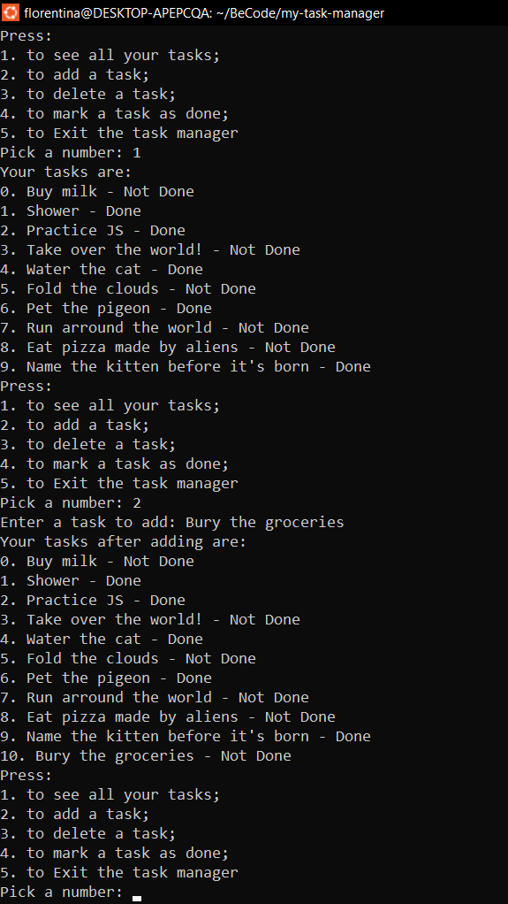

# My Task Manager - Terminal

- Repository: `my-task-manager`
- Type of Challenge: `consolidation challenge`
- Duration: `1 day`

## Mission objectives

using the file "manager.js" provided in this repo,
you can run :

```js
node manager.js
```

in your terminal, this should be the output :

```js
"Welcome to your task manager, Press:
1. to see all your tasks
2. to add a task
3. to delete a task
4. to mark a task as done
5. to Exit the task manager"
```

After that it will take an user input and react accordingly.
Each time one of the action has been performed it should return to the menu. (Except of course if we select to exit the program.)

## Consolidation objectives

- _DEV FUNDAMENTALS_
  - Solve simple algorithmic problems
  - Design a logical solution to a problem
  - Solve a basic problem using pseudocode
  - Solve a basic problem using code

## Bonus

Save the list of tasks on the file system and reload it each time we launch the application.

